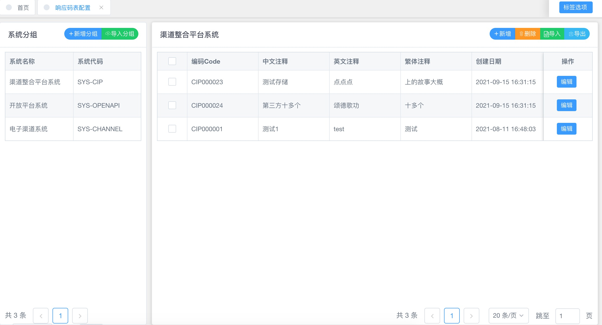
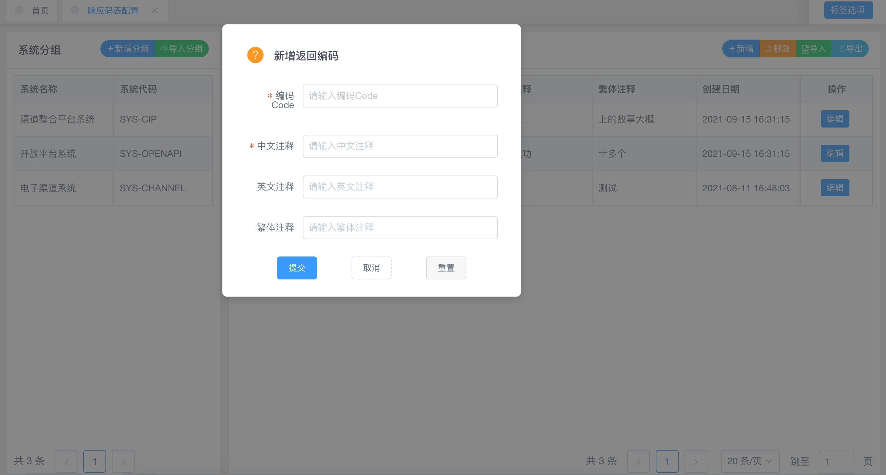
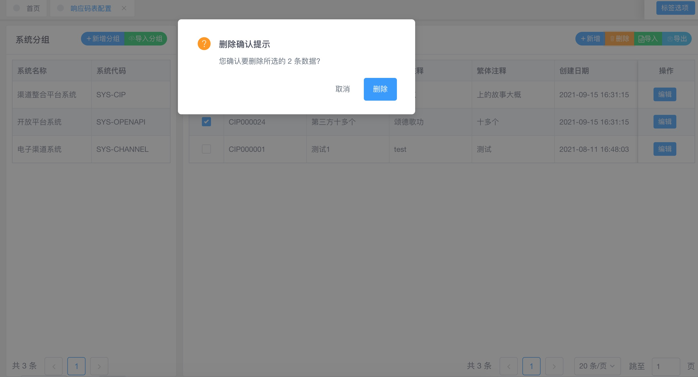

# 培训与考核题目1

### 1. 实现页面及页面功能

页面功能需求：

- 页面展现上如上图，UI布局分两个区域：左侧是系统分组，右侧是点击左侧表格某一系统条目时显示该系统分组下的所有响应码配置信息。

- 左侧分组区提供分页条，提供分组信息的新增（必须）、导入（加分项）功能。

- 右侧功能区提供分组下的列表查询，需要有分页条。

- 右侧功能区右上角的新增（必须）、删除（必须）、导入（加分项）、导出（加分项）功能。

- 右侧每一条的编辑（必须），提供已存在数据的更新维护功能。

- 点击删除按钮，注意是批量删除，需要先在表单上勾选要删除的项，如一个也没有勾选情况下应该提示如“请勾选需要删除的数据”。

  勾选存在情况下删除还应有删除确认提示（*因为有时误操作或手抖可能就把数据给不经意间删除了，因此项目中的删除动作都应有删除确认提示*）。

  > 导入功能：从文件中导入，文件格式可以是csv、excel等格式，点击页面导入按钮时选择使用者本地文件上传到后台，后台解析文件后批量入库，实现批量导入功能。
  >
  > 导出功能：从数据库中导出数据到文件，文件格式如csv、excel。

新增/编辑功能页面可参考如下弹出式的表单编辑。

删除确认提示参考：

### 2. 功能设计要点

1. 需要设计两张表，一张是系统分组表，一张是数据表。注意唯一性设计，不能同样的数据存在，比如系统代码为分组表的唯一键，编码Code及分组表的id/系统代码为数据表的唯一键。你可以这样想：不同系统下的编码code应该可以一样。
2. 需要java层编码实现dao层来对数据库的增删改查操作。
3. 需要java层编码实现service层来调用dao层实现业务功能。
4. 需要controller层编码实现web端的服务接口。
5. 需要vue web端编写展现层及数据编辑层。
6. 需要vue web端编写页面路由及服务接口定义。

3.两个表

主表firstItemSystem：mid  系统名称  系统代码

外表firstItemSystemInfo：wid    mid   编码code   中文注释   英文注释  繁体注释  创建日期

功能：查询  新增  编辑  删除   导入csv/excel
