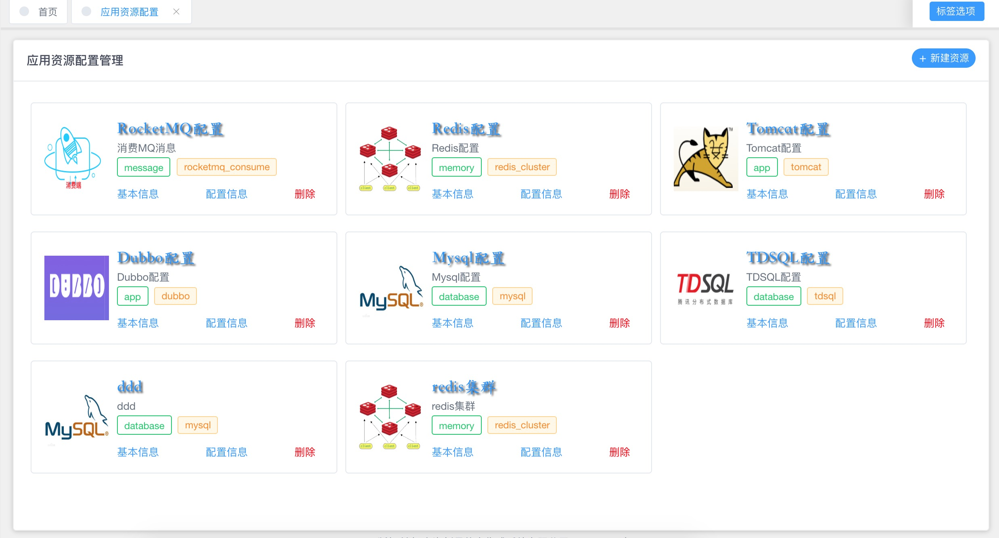
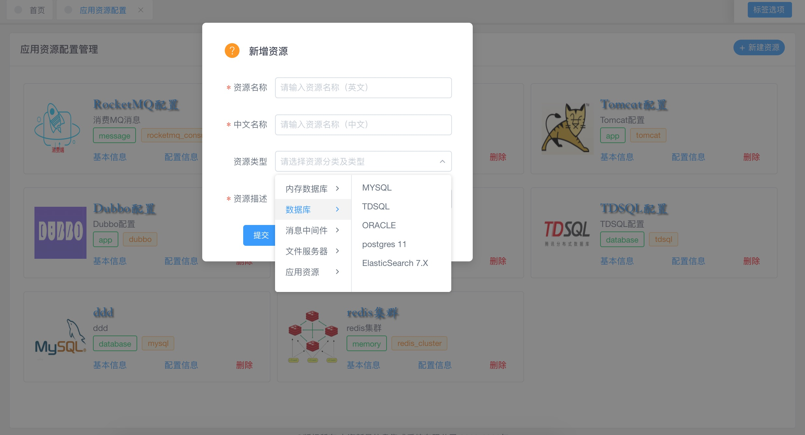
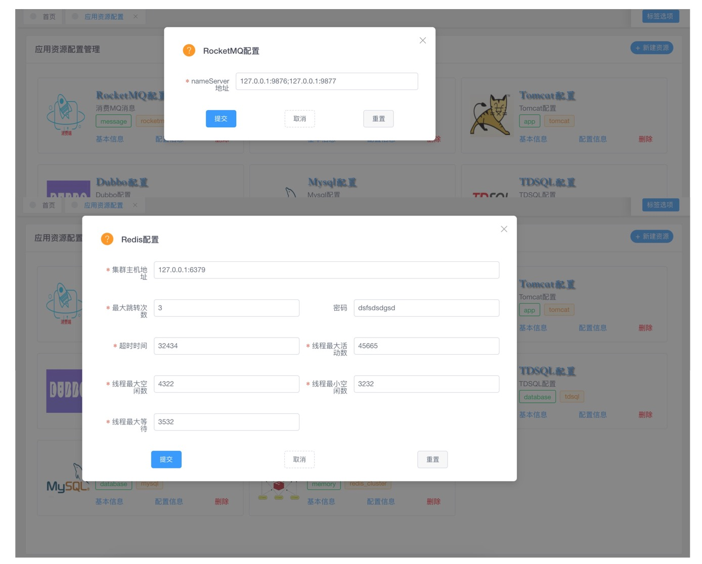

# 培训与考核题目2

### 1. 实现页面及页面功能

页面功能需求：

- 实现如上图页面展现效果，即一行显示3长条形配置信息的展现形式，图标不限可以自己随意选，文字样式也不一定要如上图，总之设计美观即可。

- 右上角新增资源，新增的是“基本信息”部分，主要包括标题，描述，分类等。

  

- 配置信息按钮点击后可编辑此配置项的数据，根据资源类型是有差异的，我们本次做两种来练习。

  - 第一个是RocketMQ配置，只有一个编辑域。

  - 第二个是Redis配置，有多个编辑域。

    > 注意：以下是两张截图给罗列在一起了，仅是表示这个题目而在此文档中展示而叠在一起以节省视图空间，开发中是各自的弹出编辑页面，不是说要开发中也重叠在一起的意思。

  

  

### 2. 功能设计要点

1. 需要设计表，一张或更多，根据自己的设计而定。
2. 需要java层编码实现dao层来对数据库的增删改查操作。
3. 需要java层编码实现service层来调用dao层实现业务功能。
4. 需要controller层编码实现web端的服务接口。
5. 需要vue web端编写展现层及数据编辑层。
6. 需要vue web端编写页面路由及服务接口定义。
