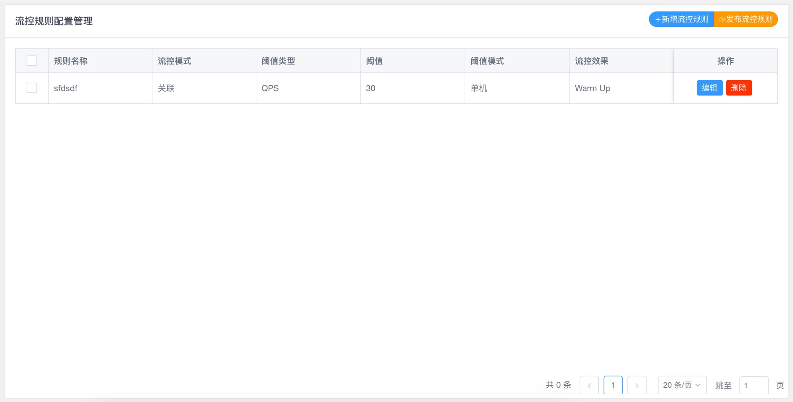
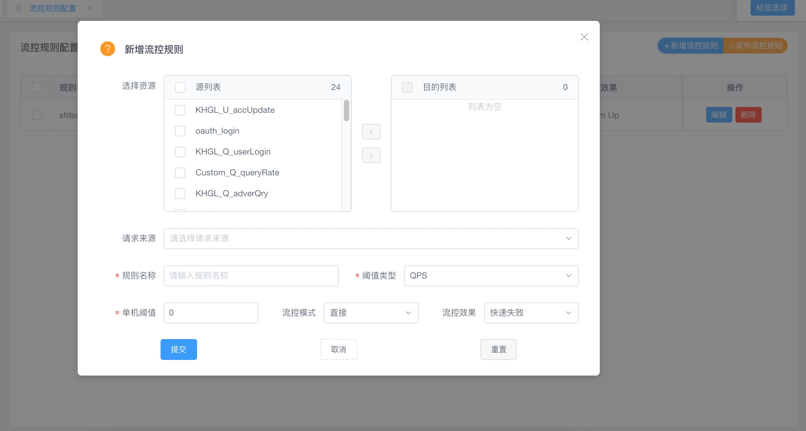

# 培训与考核题目3

### 1. 实现页面及功能

页面功能需求：

- 实现页面展现布局如上，内容区为带分页的表格，标题区值提供“新增流控规则”即可。

- 新增/编辑页面如下图，其中的请求来源下拉项：xxx系统，yyy系统，zzz系统。阈值类型下拉项：QPS，并发线程数。

  流控模式下拉项：直接，关联，链路。流控效果下拉项：快速失败，排队等候，Warm Up。以上下拉项在前端固定写死如上即可，

  数据库表字段能各自区分即可，比如整数型/枚举型/字符型等来定义。

- **选择资源项：需要开发者想办法实现当前工程提供的mvc接口清单，具体怎么采集的看各自的开发水平喽，不建议有一个手动维护的配置项，要想开发中新增、删除mvc接口时你是不是也要同时手动维护到该配置项中？是不是有点不够智能？程序人用程序人的思考方式来实现智能采集喽。具体怎么采、什么时机、什么技术手段采需要思考一下哦。**
- 每一条的编辑、删除功能也需实现。

### 2. 功能设计要点

  1. 需要相应的表，应该至少有2张吧，o(*￣︶￣*)o，比如一张是存储mvc接口清单的，一张是用来存储规则清单的，是不是哩，设计时考虑一下吧。
  2. 需要java层编码实现dao层来对数据库的增删改查操作。
  3. 需要java层编码实现service层来调用dao层实现业务功能。
  4. 需要controller层编码实现web端的服务接口。
  5. 需要vue web端编写展现层及数据编辑层。
  6. 需要vue web端编写页面路由及服务接口定义。

3.两张表

mvc接口清单直接反射读取所有存储

规则清单
